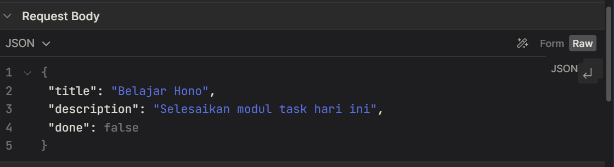
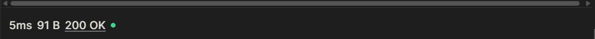
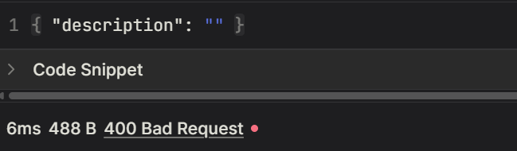
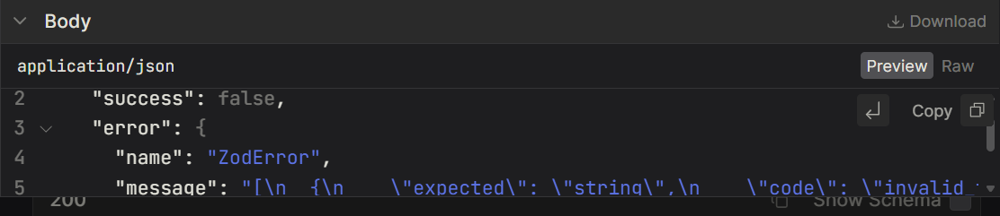

# Task API

Standalone Hono + `@hono/zod-openapi` project for practicing how to build a `task` module from scratch, following the same pattern used in `../api/`.

## How to run

```
pnpm install
pnpm run dev
```

The server runs at `http://localhost:3001`.

- OpenAPI spec (JSON): `http://localhost:3001/doc`
- Scalar API reference (interactive UI): `http://localhost:3001/scalar`

## Structure

```
src/
├── index.ts                     # entrypoint: mount router, generate /doc, serve /scalar
└── modules/task/
    ├── schema.ts                 # Zod schemas
    ├── route.ts                  # createRoute() definitions
    └── router.ts                 # OpenAPIHono router (handlers)
```

## Task 1 — Define the module

Flow: `schema.ts` → `route.ts` → `router.ts`.

1. **`schema.ts`** — define the shape of the data with Zod (`.openapi()` gives examples & schema names shown in the docs):
   - `createTaskSchema` — body for `POST /tasks` (`title`, `description`, `done`)
   - `taskSchema` — the response shape (includes `id`)
   - `taskIdParamSchema` — path param `id` for the `/tasks/{id}` route
2. **`route.ts`** — wrap each endpoint into a `createRoute({...})` definition: method, path, tags, request (params/body), and responses (status + schema). No logic here — it's purely the endpoint's contract/documentation.
   - `listTaskRoute`, `getTaskRoute`, `createTaskRoute`, `updateTaskRoute`, `deleteTaskRoute`
3. **`router.ts`** — import the routes from `route.ts`, then attach their handlers via `.openapi(route, handler)` on an `OpenAPIHono()` instance. Export it as `taskRouter`.

The same pattern can be seen for reference in `../api/src/modules/product/`.

## Task 2 — Publish the reference

Everything happens in `src/index.ts`:

1. `app.route("/tasks", taskRouter)` — mount the task module onto the main app.
2. `app.doc('/doc', { openapi: '3.1.0', info: {...} })` — generate the OpenAPI spec (`openapi.json`) from all the routes registered via `.openapi()`.
3. `app.get('/scalar', Scalar({ url: '/doc' }))` — serve the interactive documentation page (Scalar), which reads the spec from `/doc`.

Verify it: run `pnpm run dev`, then open `http://localhost:3001/scalar` — the `/tasks` endpoints should show up there with the `Task` and `CreateTask` schemas.


## Task 3 — Try both outcomes

From the Scalar page (`http://localhost:3001/scalar`):

1. Open the `POST /tasks` endpoint.
2. **Valid request** — fill in the body according to `CreateTaskSchema`, for example:
   ```json
   { "title": "Belajar Hono", "description": "Selesaikan modul task hari ini", "done": false }
   ```
   

   Click **Send Request** → status **`200 OK`**.

   **Why `200`:** the body matches `createTaskSchema` (all required fields present with the right types), so `@hono/zod-openapi` lets the request through to the handler in `router.ts`, which creates the task and returns it.

   **Response body** — the handler echoes back everything you sent, plus a server-generated `id`:
   ```json
   {
     "id": 1,
     "title": "Belajar Hono",
     "description": "Selesaikan modul task hari ini",
     "done": false
   }
   ```
   - `id` — assigned by the server (not something the client sends); this is how you'd reference the task afterward in `GET /tasks/{id}`, `PATCH`, or `DELETE`.
   - `title`, `description`, `done` — exactly what was submitted, now validated and typed according to `taskSchema`.

   
3. **Invalid request** — leave out/empty a required field, for example:
   ```json
   { "description": "" }
   ```
   

   Click **Send Request** → status **`400 Bad Request`**.

   **Why `400`:** validation runs *before* the handler, so a bad body never reaches your business logic — Hono rejects it immediately and returns Zod's own error report.

   **Response body** — a `ZodError` describing every field that failed, not just the first one:
   ```json
   {
     "success": false,
     "error": {
       "name": "ZodError",
       "message": [
         {
           "expected": "string",
           "code": "invalid_type",
           "path": ["title"],
           "message": "Invalid input: expected string, received undefined"
         },
         {
           "origin": "string",
           "code": "too_small",
           "minimum": 1,
           "inclusive": true,
           "path": ["description"],
           "message": "Too small: expected string to have >=1 characters"
         }
       ]
     }
   }
   ```
   - `success: false` — the standard `safeParse` shape Zod uses to signal validation failed.
   - `error.message` — an array, one entry per invalid field, so the client can highlight all of them at once instead of fixing one and resubmitting repeatedly.
   - First entry: `title` was omitted from the request body entirely → `code: "invalid_type"`, Zod expected a `string` but got `undefined`.
   - Second entry: `description` was sent as an empty string, which fails the schema's minimum length of 1 → `code: "too_small"`.

   

**Why this happens:** `@hono/zod-openapi` automatically validates the request (`params`/`body`) against the schema registered in `route.ts` before the handler in `router.ts` runs. If it's valid, `c.req.valid('json')` returns the validated data and the handler runs normally (200). If it's invalid, the request is rejected immediately with a 400 status and Zod's error details — the handler never executes.
